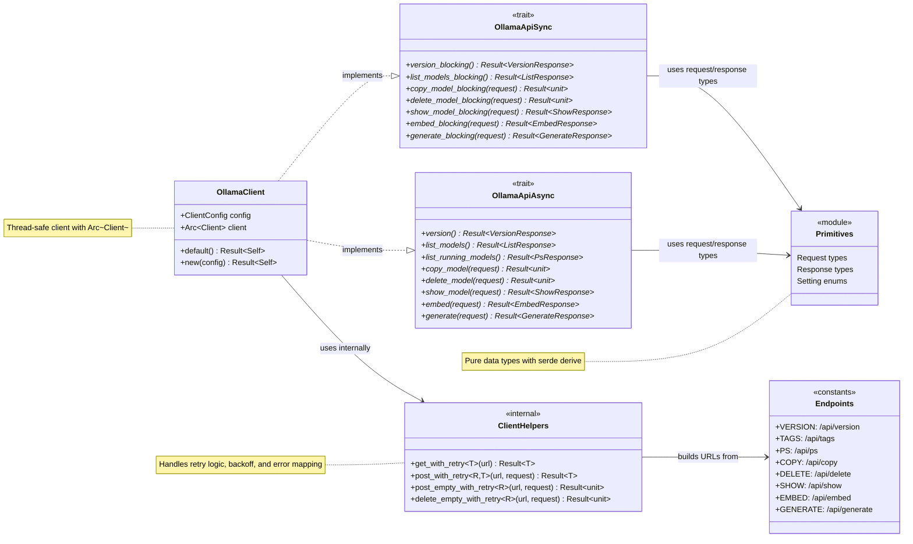
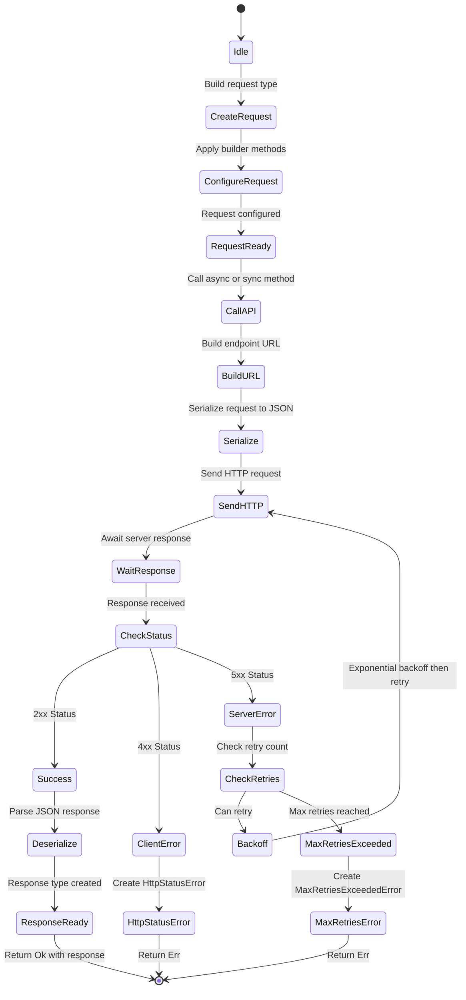
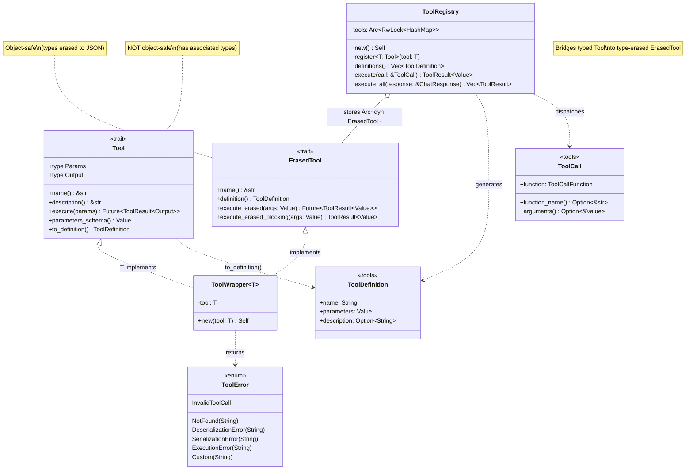
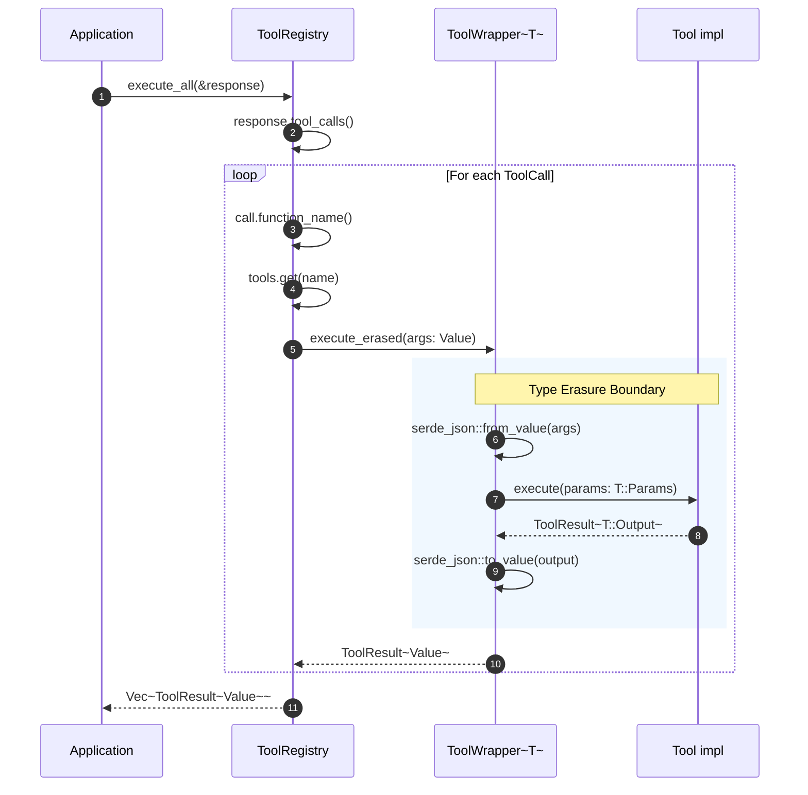

# Architecture Guide

This document describes the architectural principles and module organization of the `ollama-oxide` library.

---

## Design Principles

### 1. Single Concern Per File

Each file contains one primary type (struct, enum, or trait) with its implementations and tightly coupled helpers.

### 2. Module as Facade

The `mod.rs` file serves exclusively as a re-export facade:
- Module declarations (`mod foo;`)
- Public re-exports (`pub use foo::Foo;`)
- Module-level documentation

### 3. Explicit Over Implicit

- File names match their primary type (in snake_case)
- Public API is explicitly re-exported
- Internal details use `pub(super)` or `pub(crate)` visibility

---

## Module Organization Rule

```
module/
├── mod.rs          # Module declarations + re-exports only
├── foo.rs          # struct Foo + impl Foo + related items
└── bar.rs          # struct Bar + impl Bar + related items
```

**Example:**
```
http/
├── mod.rs          # pub use config::ClientConfig; pub use client::OllamaClient;
├── config.rs       # struct ClientConfig + impl Default
├── client.rs       # struct OllamaClient + constructors
├── api_async.rs    # trait OllamaApiAsync + impl
└── api_sync.rs     # trait OllamaApiSync + impl
```

---

## Current Structure

```
src/
├── lib.rs                          # Module declarations + re-exports + prelude
├── error.rs                        # Error enum + impl From + Result alias
├── inference/                      # Feature: "inference" (default)
│   ├── mod.rs                      # Re-exports for inference types
│   ├── version.rs                  # VersionResponse struct
│   ├── chat_*.rs                   # Chat types (#[cfg(feature = "tools")] for tool fields)
│   └── ...                         # Other inference types (generate, embed)
├── http/                           # Feature: "http" (default)
│   ├── mod.rs                      # Re-exports: ClientConfig, OllamaClient, traits
│   ├── config.rs                   # ClientConfig + impl Default
│   ├── client.rs                   # OllamaClient + constructors + validation
│   ├── api_async.rs                # OllamaApiAsync (#[cfg(feature = "model")] for model ops)
│   └── api_sync.rs                 # OllamaApiSync (#[cfg(feature = "model")] for model ops)
├── tools/                          # Feature: "tools" (optional, requires schemars + futures)
│   ├── mod.rs                      # Tool trait, ToolRegistry, ToolError, ToolCall exports
│   ├── tool_trait.rs               # Tool trait with auto-schema generation
│   ├── tool_registry.rs            # ToolRegistry for automatic dispatch
│   ├── erased_tool.rs              # Type-erased tool wrapper for registry storage
│   ├── tool_error.rs               # ToolError and ToolResult types
│   ├── tool_call.rs                # ToolCall struct (API response type)
│   ├── tool_call_function.rs       # ToolCallFunction struct
│   ├── tool_definition.rs          # ToolDefinition struct (API request type)
│   └── tool_function.rs            # ToolFunction struct
├── model/                          # Feature: "model" (optional, all model-related operations)
│   ├── mod.rs                      # All model types exports
│   ├── create_request.rs           # Model creation request
│   ├── create_response.rs          # Model creation response
│   ├── delete_request.rs           # Model deletion request
│   ├── license_setting.rs          # License configuration
│   ├── copy_request.rs             # Model copy request
│   ├── list_response.rs            # List models response
│   ├── model_details.rs            # Model details shared type
│   ├── model_summary.rs            # Model summary in list
│   ├── ps_response.rs              # Running models response
│   ├── running_model.rs            # Running model info
│   ├── show_model_details.rs       # Show model details
│   ├── show_request.rs             # Show model request
│   └── show_response.rs            # Show model response
└── conveniences/
    └── mod.rs                      # (Future: convenience APIs)
```

---

## Feature Flag Architecture

The library uses Cargo features to provide a modular, opt-in design:

```toml
[features]
default = ["http", "inference"]       # Standard usage
conveniences = ["http", "inference"]  # High-level APIs
http = []                             # HTTP client layer
inference = []                        # Inference types (chat, generate, embed)
tools = ["dep:schemars", "dep:futures"] # Ergonomic function calling
model = ["http", "inference"]         # All model operations (list, show, copy, create, delete)
```

### Feature Dependency Graph

```
                    ┌─────────────┐
                    │   default   │
                    └──────┬──────┘
                           │
              ┌────────────┴────────────┐
              │                         │
        ┌─────▼─────┐            ┌──────▼──────┐
        │    http   │            │  inference  │
        └───────────┘            └─────────────┘
              │                         │
              └────────────┬────────────┘
                           │
        ┌──────────────────┼──────────────────┐
        │                  │                  │
  ┌─────▼─────┐     ┌──────▼──────┐    ┌──────▼──────┐
  │   model   │     │conveniences │    │   tools     │
  │(opt-in)   │     │  (future)   │    │ (optional)  │
  └───────────┘     └─────────────┘    └─────────────┘
        │                                     │
        ▼                                     ▼
  Model management                      dep:schemars
  (list/show/copy/create/delete)        dep:futures
```

### Conditional Compilation Patterns

The codebase uses `#[cfg(feature = "...")]` at three levels:

**1. Module Level** - Entire modules gated in `lib.rs`:
```rust
#[cfg(feature = "tools")]
pub mod tools;

#[cfg(feature = "model")]
pub mod model;
```

**2. Struct Field Level** - Optional fields in inference types:
```rust
pub struct ChatRequest {
    pub model: String,
    pub messages: Vec<ChatMessage>,
    #[cfg(feature = "tools")]
    #[serde(skip_serializing_if = "Option::is_none")]
    pub tools: Option<Vec<ToolDefinition>>,
}
```

**3. Method Level** - Conditional method implementations:
```rust
impl ChatRequest {
    #[cfg(feature = "tools")]
    pub fn with_tools(mut self, tools: Vec<ToolDefinition>) -> Self {
        self.tools = Some(tools);
        self
    }
}
```

### Example and Test Gating

Examples and tests requiring specific features use `required-features`:

```toml
[[example]]
name = "chat_with_tools_async"
required-features = ["tools"]

[[example]]
name = "model_create_async"
required-features = ["model"]

[[test]]
name = "client_model_tests"
required-features = ["model"]
```

---

## Adding New Components

### New Primitive Type

1. Create `src/inference/model_info.rs`:
   ```rust
   use serde::{Deserialize, Serialize};

   #[derive(Debug, Clone, PartialEq, Serialize, Deserialize)]
   pub struct ModelInfo {
       pub name: String,
       pub size: u64,
   }
   ```

2. Update `src/inference/mod.rs`:
   ```rust
   mod version;
   mod model_info;

   pub use version::VersionResponse;
   pub use model_info::ModelInfo;
   ```

### New HTTP Endpoint

Update `src/http/api_async.rs` and `src/http/api_sync.rs` with new methods.

### New Configuration Option

Add field to `ClientConfig` in `src/http/config.rs` and update `impl Default`.

---

## Design Patterns

### Visibility Control

```rust
pub struct OllamaClient {
    pub(super) config: ClientConfig,  // Visible in http module only
    pub(super) client: Arc<Client>,
}
```

Allows trait implementations in sibling files to access internals while keeping them private externally.

### Trait per Concern

Separate async and sync traits for clear separation of concerns.

### Dependency Hierarchy

The crate follows a strict layered architecture where higher-level modules can depend on lower-level modules, but never the reverse.

```
┌─────────────────────────────────────────┐
│            lib.rs (re-exports)          │  ← Top: Facade only
├─────────────────────────────────────────┤
│    tools/ (Tool, ToolRegistry)          │  ← High: Uses inference (optional)
├─────────────────────────────────────────┤
│    http/ (client, api_async, api_sync)  │  ← High: Uses inference, model
├─────────────────────────────────────────┤
│    model/ (CreateRequest, etc.)         │  ← Mid: Independent types (optional)
├─────────────────────────────────────────┤
│    inference/ (request/response types)  │  ← Low: Independent types
├─────────────────────────────────────────┤
│    error.rs                             │  ← Base: Used by all
└─────────────────────────────────────────┘
```

**Dependency Rules:**

| Module | Can depend on | Cannot depend on |
|--------|---------------|------------------|
| `error` | std, external crates | inference, http, tools, model |
| `inference` | error, serde, std | http, tools, model |
| `model` | error, serde, std | http, tools |
| `http` | error, inference, model, reqwest | tools |
| `tools` | error, serde, schemars, futures | http, model, inference |
| `lib.rs` | all (re-exports only) | — |

**Key Principle:** Inference types must remain pure data types with no knowledge of how they are transported. This ensures:

1. **Testability** - Primitives can be tested without HTTP mocking
2. **Reusability** - Primitives can be used with different transports
3. **Documentation** - Primitive doc examples use JSON, not client code

**Anti-pattern to avoid:**
```rust
// ❌ BAD: Primitive importing from http module
// src/model/show_response.rs
use crate::http::OllamaApiAsync;  // WRONG!
```

**Correct pattern:**
```rust
// ✅ GOOD: HTTP module importing inference types
// src/http/api_async.rs
use crate::{ShowRequest, ShowResponse};  // Correct direction
```

---

## Architecture Diagrams

### Module and Component Relations

This diagram shows how components interact in the ollama-oxide library.



### API Call Flow

This diagram shows the lifecycle of any API call through the library.



### Request Type Patterns

All request types follow these patterns:

| Pattern | Description | Example |
|---------|-------------|---------|
| `RequestType::new()` | Constructor with required fields | `GenerateRequest::new("model", "prompt")` |
| `.with_*()` builder | Optional field setter, returns Self | `.with_system("You are helpful")` |
| `#[serde(skip_serializing_if)]` | Omit None fields from JSON | Optional fields not sent |
| `impl From<T>` | Ergonomic conversions | `"text".into()` for string fields |

### Response Type Patterns

All response types follow these patterns:

| Pattern | Description | Example |
|---------|-------------|---------|
| `#[serde(default)]` | Handle missing JSON fields | Fields default to None |
| Helper methods | Convenient accessors | `response.text()` |
| Duration conversions | Nanoseconds to milliseconds | `response.total_duration_ms()` |
| Metric calculations | Derived values | `response.tokens_per_second()` |


### Tools Module Components

This diagram shows the tools module class hierarchy and dependencies (requires `tools` feature).



### Tool Execution Flow

This sequence diagram shows how tool calls are dispatched from a ChatResponse.



---

## Testing Architecture

**Test locations:**
1. **Unit tests in source files**: `src/**/*.rs` (in `#[cfg(test)] mod tests` blocks) - test internal behavior
2. **Public interface tests**: `tests/*.rs` - test public API contracts with mocking
3. **Integration tests**: `examples/*.rs` - test against real Ollama server

### Unit Tests (inside source files)
Component-level tests live alongside the code:
- Located in `#[cfg(test)] mod tests` blocks
- Test internal/private behavior
- Feature-gated tests use `#[cfg(feature = "...")]`

### Public Interface Tests (`tests/` folder)
All files in `tests/*.rs` must be **unit tests only**:
- Use `mockito` for HTTP mocking
- No external service dependencies
- Must pass without Ollama running
- Run with `cargo test`

### Integration Tests (`examples/` folder)
Integration tests are implemented as **examples**:
- Require running Ollama server
- Demonstrate real API usage
- Run with `cargo run --example <name>`

**Rule:** Never add tests to `tests/` folder that require external services.

---

## Migration Checklist

- [ ] Identify distinct components/types
- [ ] Create one file per component (`component_name.rs`)
- [ ] Move type definition + implementations to new file
- [ ] Update visibility (`pub(super)` for internal sharing)
- [ ] Clear out `mod.rs`, add `mod` declarations and re-exports
- [ ] Run `cargo build`, `cargo test`, `cargo clippy`

---

## Version History

- **2026-02-03**: Tool types (ToolCall, ToolDefinition) moved from inference to tools module
- **2026-02-01**: Added feature flag architecture documentation (tools, model features)
- **2026-01-13**: Initial architecture document

---

## References

- [Rust API Guidelines](https://rust-lang.github.io/api-guidelines/)
- [Cargo Book - Package Layout](https://doc.rust-lang.org/cargo/guide/project-layout.html)
