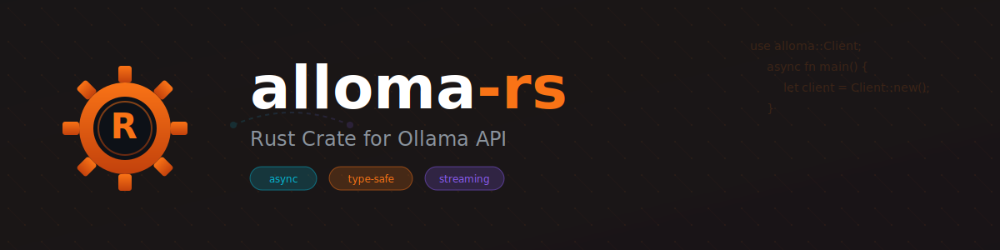
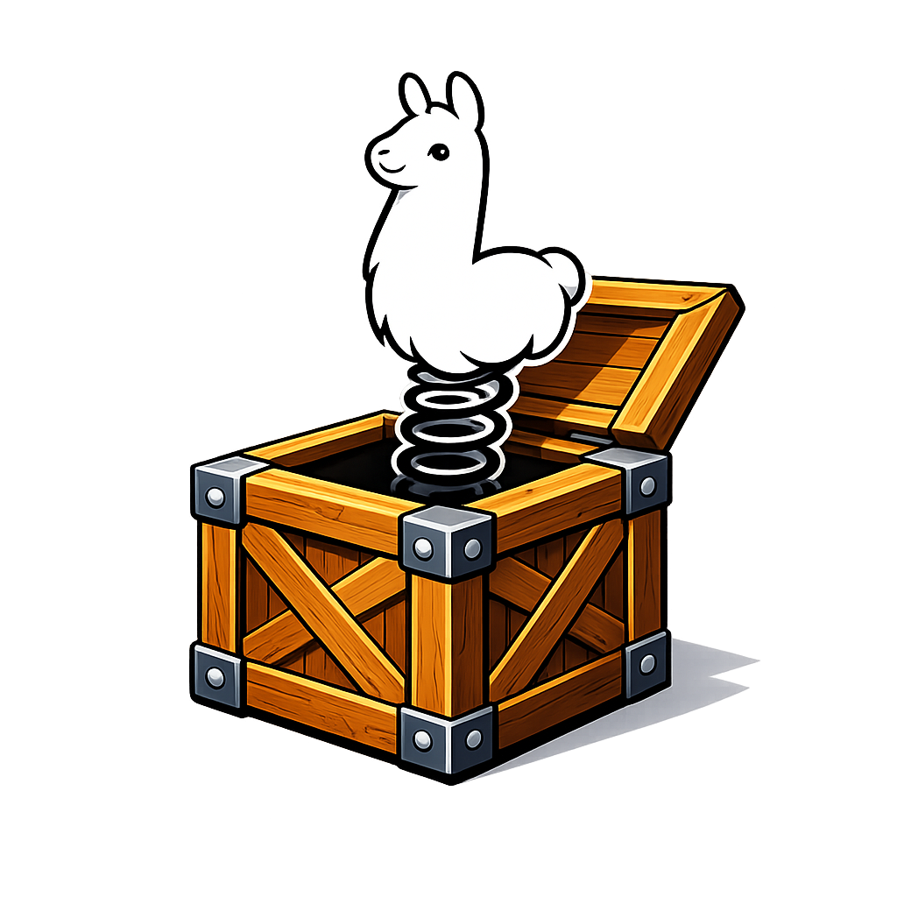

# ollama-oxide
<div align="center">
  
</div>
The Llama in the Crate is a Rust library providing low-level primitives and high-level conveniences for integrating with [Ollama](https://github.com/ollama)'s native API.
<div align="center">
  
</div>

## Features

- **Low-level primitives** for direct Ollama API interaction
- **High-level conveniences** (optional) for common use cases
- **Async/await support** with Tokio runtime
- **Type-safe API bindings** generated from OpenAPI specs
- **Comprehensive error handling**
- **HTTP/2 support** via reqwest
- **Feature flags** for modular dependencies

## Architecture

Single-crate design with modular structure and feature flags:

```
ollama-oxide/
└── src/
    ├── lib.rs           # Main library entry point
    ├── primitives/      # Low-level API primitives (default)
    ├── http/            # HTTP client layer (default)
    ├── tools/           # Ergonomic function calling (optional)
    ├── create/          # Model creation/deletion (optional)
    └── conveniences/    # High-level APIs (optional)
```

## Feature Flags

The library uses feature flags to let you include only what you need:

| Feature | Dependencies | Purpose |
|---------|-------------|---------|
| `default` | `http`, `primitives` | Standard usage - HTTP client + all data types |
| `primitives` | - | Standalone data types for serialization/deserialization |
| `http` | - | HTTP client implementation (async/sync) |
| `tools` | `schemars`, `futures` | Ergonomic function calling with auto-generated JSON schemas |
| `model` | `http`, `primitives` | Model creation/deletion API (opt-in for destructive operations) |
| `conveniences` | `http`, `primitives` | High-level ergonomic APIs |

## Installation

Add this to your `Cargo.toml`:

```toml
# Default features (primitives + http)
[dependencies]
ollama-oxide = "0.1.0"

# With function calling support
[dependencies]
ollama-oxide = { version = "0.1.0", features = ["tools"] }

# With model creation/deletion
[dependencies]
ollama-oxide = { version = "0.1.0", features = ["model"] }

# Full featured
[dependencies]
ollama-oxide = { version = "0.1.0", features = ["tools", "model"] }

# Data types only (no HTTP client)
[dependencies]
ollama-oxide = { version = "0.1.0", default-features = false, features = ["primitives"] }
```

## Quick Start

```rust
#[tokio::main]
fn main() -> Result<(), Box<dyn std::error::Error>> {
    todo!("Working ");
}
```

## Requirements

- Rust 1.75+ (edition 2024)
- [Ollama](https://github.com/ollama) running locally or accessible via network

## Development

### Building

```bash
cargo build
```

### Running Tests

```bash
cargo test
```

### Running Examples

```bash
cargo run --example basic_generation
```

## API Documentation

The library follows Ollama's OpenAPI specifications (see [spec/primitives/](spec/primitives/)).

**12 Total Endpoints:**
- 5 Simple endpoints (version, tags, ps, copy, delete)
- 2 Medium complexity (show, embed)
- 5 Complex with streaming (generate, chat, create, pull, push)

See [spec/api-analysis.md](spec/api-analysis.md) for detailed endpoint documentation.

## Contributing

Contributions are welcome! Please read [CONTRIBUTING.md](CONTRIBUTING.md) for guidelines.

## License

This project is licensed under the MIT License - see the [LICENSE](LICENSE) file for details.

## Acknowledgments

Based on [Ollama's](https://github.com/ollama) official libraries and API specifications.

## Links

- [Repository](https://github.com/franciscotbjr/ollama-oxide)
- [Ollama Documentation](https://github.com/ollama)
- [Issue Tracker](https://github.com/franciscotbjr/ollama-oxide/issues)

